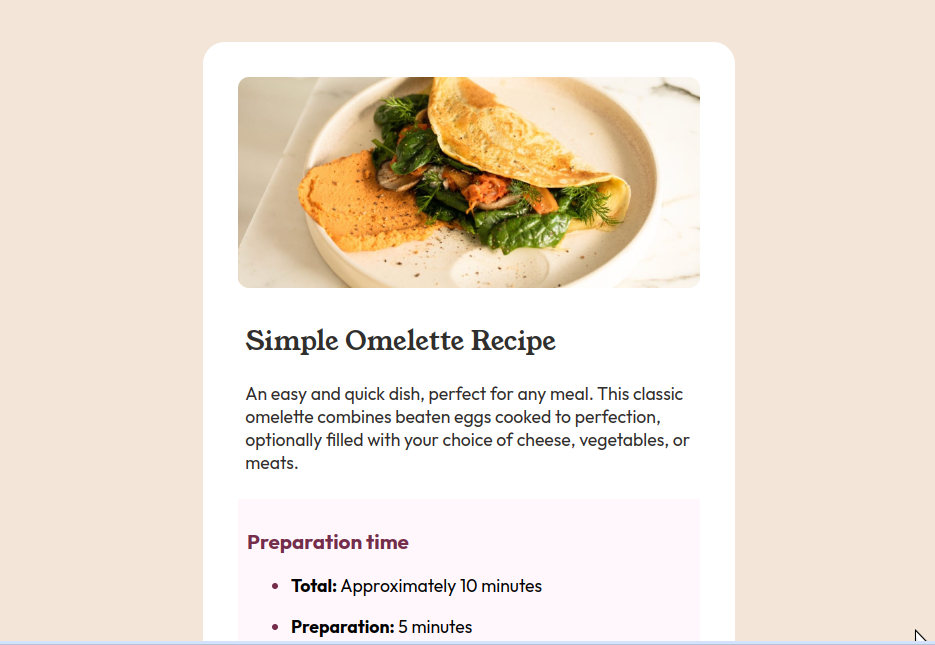

# Frontend Mentor - Recipe page solution

This is a solution to the [Recipe page challenge on Frontend Mentor](https://www.frontendmentor.io/challenges/recipe-page-KiTsR8QQKm). Frontend Mentor challenges help you improve your coding skills by building realistic projects. 

### Screenshot

### Links

- Solution URL: [Link to code](https://github.com/vipinsharmaa/recipe-page-frontend-mentor)
- Live Site URL: [Live Link](https://vipinsharmaa.github.io/recipe-page-frontend-mentor/)

### Built with

- Semantic HTML5 markup
- CSS custom properties
- Flexbox

## Author

- Frontend Mentor - [@vipinsharmaa](https://www.frontendmentor.io/profile/vipinsharmaa)
- Twitter - [@codecrash007](https://www.twitter.com/codecrash007)
